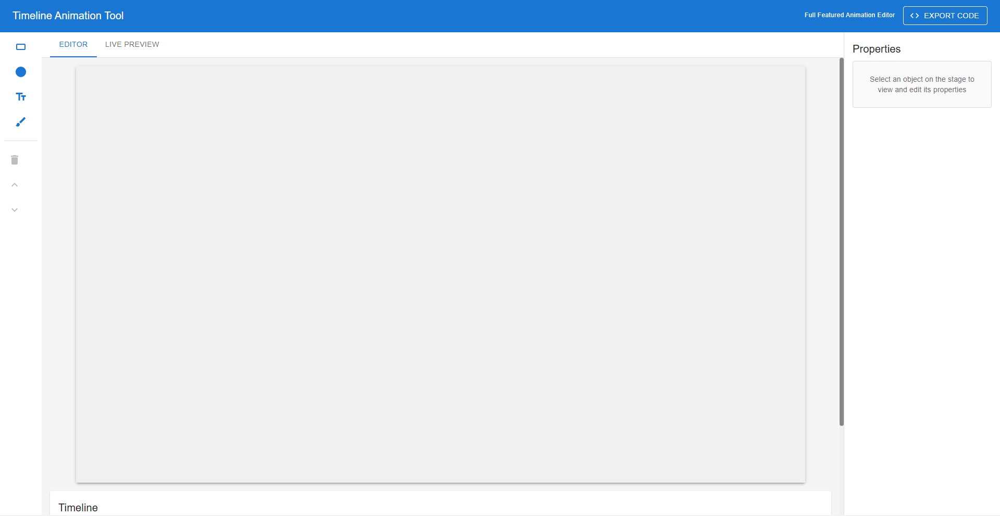

# Timeline Animation Tool



> A powerful, browser-based animation editor that lets you create keyframe animations visually — then export them as production-ready standalone HTML/CSS/JavaScript code powered by GSAP.

---

## 🎬 Demo

> 🔗 **Live Demo:** [Timeline Animation Tool](https://timeline-animation-tool-project.vercel.app/)

---

## 📋 Table of Contents

- [What It Does](#what-it-does)
- [Key Features](#key-features)
- [Technologies Used](#technologies-used)
- [Architecture Overview](#architecture-overview)
- [Project Structure](#project-structure)
- [How to Run Locally](#how-to-run-locally)
- [How to Use](#how-to-use)
- [How the Export Works](#how-the-export-works)
- [Technical Deep Dives](#technical-deep-dives)
- [Known Limitations](#known-limitations)
- [Future Improvements](#future-improvements)

---

## What It Does

The Timeline Animation Tool is a **visual keyframe animation editor** built entirely in the browser. It allows users to:

1. **Create objects** on a canvas — rectangles, circles, text, and freehand drawings.
2. **Set keyframes** at specific points on a timeline to define position, scale, rotation, and opacity.
3. **Preview animations** in real time using a GSAP-powered live preview that matches the final output exactly.
4. **Export animations** as three standalone files (`index.html`, `style.css`, `animation.js`) that can run in any modern browser with zero dependencies beyond a CDN-hosted GSAP library.

Think of it as a lightweight alternative to tools like Adobe Animate or After Effects, but designed specifically for web developers who need clean, exportable code.

---

## Key Features

| Feature | Description |
|---|---|
| **Multi-Object Canvas** | Add rectangles, circles, text, and freehand drawings to a shared canvas. |
| **Freehand Drawing** | Draw paths directly on the canvas with configurable color, stroke width, and curve smoothing. |
| **Keyframe Timeline** | Place keyframes along a timeline scrubber. Each keyframe captures an object's full transform state. |
| **Easing Functions** | Per-keyframe easing — linear, ease-in/out (Quad, Cubic, Quart), bounce, and elastic. |
| **Live Preview** | A GSAP-driven preview panel that renders the animation identically to the exported code. |
| **Code Export** | Generates complete, standalone HTML + CSS + JS files. No build step required to run. |
| **Looping Playback** | Toggle loop mode for continuous animation playback during editing. |
| **Layer Controls** | Bring objects forward or send them backward in the z-order. |
| **Properties Panel** | Edit position, scale, rotation, and opacity numerically or by dragging on canvas. |
| **Keyboard Shortcuts** | Delete selected objects with `Delete`/`Backspace`. Exit drawing mode with `Escape`. |

---

## Technologies Used

### Core Framework & Libraries

| Technology | Role |
|---|---|
| **React 18** | UI framework. Component-based architecture for the editor, canvas, timeline, and panels. |
| **Recoil** | Global state management. Manages shared state (canvas objects, keyframes, playback) across deeply nested components without prop drilling. |
| **Fabric.js** | Interactive HTML5 canvas library. Handles object rendering, selection, dragging, scaling, rotation, and freehand drawing on the editor canvas. |
| **GSAP (GreenSock)** | Animation engine used in the Live Preview and in all exported code. Provides smooth, high-performance animations with easing support. |
| **Material UI (MUI)** | Component library providing the UI shell — panels, buttons, sliders, tabs, menus, and dialogs. |

### Tooling & Build

| Technology | Role |
|---|---|
| **Vite** | Development server and build tool. Chosen for fast hot-module replacement during development. |
| **React Router** | Client-side routing (currently single-route, extensible for future pages). |

### Why These Choices?

- **Recoil over Redux/Zustand:** The animation editor has many interdependent state slices (selected object ↔ keyframes ↔ timeline position ↔ canvas render). Recoil's atom/selector model maps cleanly onto this without heavy boilerplate.
- **Fabric.js over raw Canvas API:** Fabric.js abstracts away hit-testing, selection handles, transforms, and event handling — all critical for an interactive editor — while still giving access to the underlying canvas for custom drawing.
- **GSAP in exports:** GSAP is the industry standard for web animations. Using it in exports means the generated code is performant, well-supported, and familiar to any web developer.

---

## Architecture Overview

```
┌─────────────────────────────────────────────────────────────────┐
│                        Browser (React App)                       │
│                                                                 │
│  ┌──────────┐   ┌─────────────────────────────────────────┐    │
│  │ Toolbar  │   │              Main Content                 │    │
│  │          │   │                                           │    │
│  │ • Rect   │   │  ┌─── Tab: EDITOR ───────────────────┐  │    │
│  │ • Circle │   │  │                                    │  │    │
│  │ • Text   │   │  │   ┌──────────────────────────┐    │  │    │
│  │ • Draw   │   │  │   │   Fabric.js Canvas       │    │  │    │
│  │ • Delete │   │  │   │   (Object Manipulation)  │    │  │    │
│  │ • Z-Order│   │  │   └──────────────────────────┘    │  │    │
│  └──────────┘   │  │                                    │  │    │
│                 │  │   ┌──────────────────────────┐    │  │    │
│                 │  │   │      Timeline Panel      │    │  │    │
│                 │  │   │  • Scrubber              │    │  │    │
│                 │  │   │  • Playback Controls     │    │  │    │
│                 │  │   │  • Per-Object Tracks     │    │  │    │
│                 │  │   │  • Keyframe Diamonds     │    │  │    │
│                 │  │   └──────────────────────────┘    │  │    │
│                 │  └────────────────────────────────────┘  │    │
│                 │                                           │    │
│                 │  ┌─── Tab: LIVE PREVIEW ──────────────┐  │    │
│                 │  │                                     │  │    │
│                 │  │   ┌─────────────────────────┐      │  │    │
│                 │  │   │  GSAP Timeline          │      │  │    │
│                 │  │   │  (DOM + SVG Elements)   │      │  │    │
│                 │  │   └─────────────────────────┘      │  │    │
│                 │  └─────────────────────────────────────┘  │    │
│                 └───────────────────────────────────────────┘    │
│                                                                 │
│  ┌─────────────────┐                                            │
│  │ Properties Panel│                                            │
│  │ • X / Y         │                                            │
│  │ • Scale X / Y   │                                            │
│  │ • Rotation      │                                            │
│  │ • Opacity       │                                            │
│  │ • Drawing Opts  │                                            │
│  └─────────────────┘                                            │
│                                                                 │
│  ┌─────────────────────────────────────────────────────────┐   │
│  │                     Recoil State Layer                    │   │
│  │  canvasObjects │ keyframes │ currentTime │ selectedObject│   │
│  │  fabricCanvas  │ duration  │ isPlaying   │ drawingMode   │   │
│  └─────────────────────────────────────────────────────────┘   │
│                                                                 │
│  ┌─────────────────────────────────────────────────────────┐   │
│  │                      Utility Modules                     │   │
│  │  fabricHelpers.js │ interpolation.js │ codeGenerator.js  │   │
│  │  easing.js                                               │   │
│  └─────────────────────────────────────────────────────────┘   │
└─────────────────────────────────────────────────────────────────┘
```

### Data Flow

```
User Action (drag, click, draw)
        │
        ▼
  Fabric.js Canvas Event
        │
        ▼
  Extract Properties (fabricHelpers.js)
        │  x, y, scaleX, scaleY, rotation, opacity
        ▼
  Recoil State Update
        │  canvasObjects, keyframes, selectedObject
        ▼
  ┌─────────────────────┐     ┌──────────────────────────┐
  │  Editor Canvas       │     │  Live Preview            │
  │  (interpolation.js)  │     │  (GSAP timeline)         │
  │  Lerp between KFs    │     │  Mirrors editor exactly  │
  └─────────────────────┘     └──────────────────────────┘
        │
        ▼ (on Export)
  Code Generator (codeGenerator.js)
        │
        ▼
  index.html + style.css + animation.js
```

---

## Project Structure

```
Timeline Animation Tool/
├── public/
│   └── index.html
├── src/
│   ├── main.jsx                    # App entry point, Recoil + Router + MUI theme
│   ├── App.jsx                     # Route definitions
│   ├── App.css                     # Global styles
│   ├── index.css                   # CSS reset and base styles
│   │
│   ├── store/                      # Global state management (Recoil)
│   │   ├── atoms.jsx               # All state atoms (objects, keyframes, playback, drawing)
│   │   ├── selectors.jsx           # Derived state (selected object details, keyframe counts)
│   │   └── hooks.jsx               # Custom hooks wrapping useRecoilState for each atom
│   │
│   ├── components/
│   │   ├── Layout/
│   │   │   ├── MainLayout.jsx      # Top-level layout: header, toolbar, tabs, properties panel
│   │   │   └── Header.jsx          # App bar with title and Export Code button
│   │   │
│   │   ├── Canvas/
│   │   │   └── Canvas.jsx          # Fabric.js canvas — object creation, selection, drawing, interpolation
│   │   │
│   │   ├── Timeline/
│   │   │   ├── Timeline.jsx        # Timeline container
│   │   │   ├── PlaybackControls.jsx# Play/pause/stop, loop toggle, keyframe nav, add keyframe
│   │   │   ├── TimelineScrubber.jsx # Time slider
│   │   │   └── TimelineTrack.jsx   # Per-object track with keyframe diamonds + context menu
│   │   │
│   │   ├── Toolbar/
│   │   │   ├── Toolbar.jsx         # Left sidebar: add objects, drawing mode, delete, z-order
│   │   │   └── DrawingSettings.jsx # Color, stroke width, smoothing controls for drawing tool
│   │   │
│   │   ├── PropertiesPanel/
│   │   │   └── PropertiesPanel.jsx # Right sidebar: numeric property editors for selected object
│   │   │
│   │   └── CodeExport/
│   │       ├── CodeExportDialog.jsx# Modal showing generated code with copy/download
│   │       └── LivePreview.jsx     # GSAP-powered animation preview matching exported output
│   │
│   └── utils/                      # Pure utility functions (no React dependencies)
│       ├── fabricHelpers.js        # Create Fabric objects, extract properties, find by ID
│       ├── interpolation.js        # Keyframe interpolation with easing between two keyframes
│       ├── easing.js               # Easing function implementations + GSAP name mapping
│       └── codeGenerator.js        # Generates HTML, CSS, JS strings from animation state
│
├── package.json
├── vite.config.js
└── README.md
```

---

## How to Run Locally

### Prerequisites

- **Node.js** v18 or higher
- **npm** v9 or higher

### Steps

```bash
# 1. Clone the repository
git clone <your-repo-url>
cd "Timeline Animation Tool"

# 2. Install dependencies
npm install

# 3. Start the development server
npm run dev

# 4. Open in browser
# Navigate to http://localhost:5173
```

### Available Scripts

| Script | Description |
|---|---|
| `npm run dev` | Starts the Vite development server with hot reload |
| `npm run build` | Produces a production build in the `dist/` folder |
<!-- | `npm run preview` | Serves the production build locally for testing | -->

---

## How to Use

### 1. Adding Objects

Use the **left toolbar** to add objects to the canvas:

- **Rectangle** — adds a 100×100 blue rectangle
- **Circle** — adds a 100px red circle
- **Text** — adds an editable text element (double-click to edit)
- **Drawing Tool (brush icon)** — enters freehand drawing mode. Configure color, stroke width, and smoothing in the Properties Panel. Press `Escape` or click the brush icon again to exit.

### 2. Selecting & Moving Objects

Click any object on the canvas to select it. Drag to move, or use the corner handles to scale and rotate. All changes are reflected instantly in the Properties Panel on the right.

You can also click an object's **name in the timeline** to select it from the panel.

### 3. Setting Keyframes

1. Select an object on the canvas.
2. Move the **timeline scrubber** to the desired time.
3. Position/transform the object where you want it at that moment.
4. Click **Add Keyframe** in the playback controls.

Repeat at different times to create motion. The editor automatically interpolates between keyframes.

### 4. Adjusting Easing

Right-click a **keyframe diamond** on any timeline track to open a context menu. Choose from:

- Linear
- Ease In / Out / In-Out (Quad, Cubic)
- Bounce
- Elastic

### 5. Previewing

Click the **Live Preview** tab to see your animation play back using GSAP — this is the exact same engine and output as the exported code.

### 6. Exporting

Click **Export Code** in the top-right header. A dialog shows the generated `HTML`, `CSS`, and `JavaScript` across tabs. You can:

- **Copy** individual files to clipboard
- **Download All** — saves `index.html`, `style.css`, and `animation.js` to your machine

Open `index.html` in any browser. No server or build step required.

---

## How the Export Works

This section explains the technical decisions behind code generation — useful context for interviews or code reviews.

### Coordinate System Translation

Fabric.js positions objects by their **center point**. CSS positions elements by their **top-left corner**. The exporter converts between these:

```
CSS left = Fabric left - (element width / 2)
CSS top  = Fabric top  - (element height / 2)
```

For a 100×100 circle at Fabric position (200, 200):
- CSS left = 200 - 50 = 150px
- CSS top  = 200 - 50 = 150px

### Freehand Path Export Strategy

Paths are the trickiest element to export correctly. The solution uses a **delta-based translate** approach:

1. Path data contains **absolute canvas coordinates** baked in from when you drew it.
2. The SVG is rendered at **full canvas size** (1200×600) with no `viewBox` transformation, so the path appears exactly where it was drawn.
3. Movement is animated as a **translate delta** — the difference between each keyframe's position and the first keyframe's position — using GSAP's `x`/`y` properties (CSS transforms), not `left`/`top`.

This avoids the need to recalculate or rewrite path coordinates on every keyframe.

### Easing Mapping

The app's internal easing names are mapped to GSAP equivalents at export time:

| Internal Name | GSAP Equivalent |
|---|---|
| `linear` | `none` |
| `easeInQuad` | `power1.in` |
| `easeOutCubic` | `power2.out` |
| `bounce` | `bounce.out` |
| `elastic` | `elastic.out` |

---

## Technical Deep Dives

### State Management with Recoil

The app uses **atoms** for each piece of state and **selectors** for derived data:

- `canvasObjectsState` — array of all objects on the canvas (id, type, name, path data)
- `keyframesState` — map of object ID → sorted array of keyframes, each containing time, properties, and easing
- `currentTimeState` — the current scrubber position in seconds
- `fabricCanvasState` — a direct reference to the Fabric.js canvas instance (marked `dangerouslyAllowMutability`)

Selectors like `selectedObjectDetailsSelector` automatically recompute when their dependent atoms change, keeping the UI in sync without manual subscriptions.

### Interpolation Engine

Between two keyframes, every animatable property is interpolated using **linear interpolation (lerp)** with an optional easing function applied to the time factor `t`:

```
t_raw  = (currentTime - keyframeA.time) / (keyframeB.time - keyframeA.time)
t      = easingFunction(t_raw)
value  = lerp(keyframeA.value, keyframeB.value, t)
```

This runs on every animation frame during playback and scrubbing, keeping the Fabric.js canvas perfectly in sync with the timeline.

### Drawing Tool & Path Smoothing

When smoothing is enabled, raw mouse points are converted into **quadratic Bézier curves** (`Q` commands in SVG path syntax) using midpoint interpolation between consecutive points. This produces smooth, natural-looking strokes instead of jagged line segments.

---

## Known Limitations

- **Text editing** is done via a browser `prompt()` dialog (double-click text to edit). A dedicated inline text editor is planned.
- **Non-uniform scaling** (different scaleX and scaleY) is captured in keyframes but the live preview and export currently animate uniform scale. Full non-uniform scale export is a planned improvement.
- **No undo/redo** system is implemented yet.
- **Export does not support nested animations** or grouped objects — each object animates independently.

---

## Future Improvements

- Undo / Redo system
- Inline text editing on canvas
- Object grouping and group transforms
- Non-uniform scale in exports
- Color/fill animation (animate object color over time)
- Path morphing (animate one shape into another)
- Save / Load project files (JSON export of full animation state)
- Multiple canvases / scenes
- Onion skinning for frame-by-frame animation
- Audio track sync

---

## License

This project is licensed under the **MIT License**.

---

*Built as a portfolio project demonstrating React architecture, state management, canvas manipulation, animation engines, and code generation.*